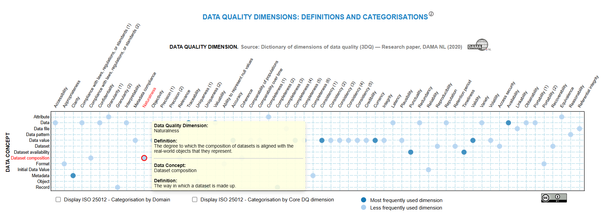
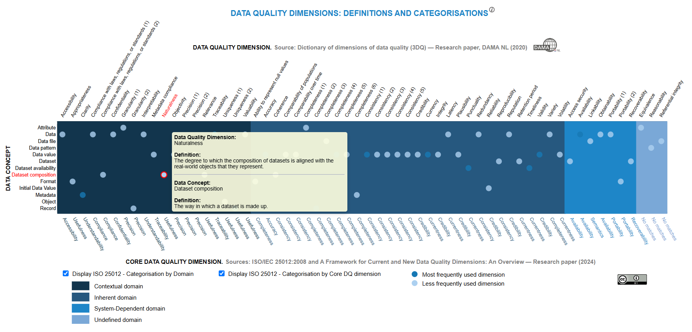

## Data Quality Dimensions, Definitions and Data Concepts

### Background

In 2020, the Data Quality working group of the Data Management Association in the Netherlands (DAMA NL), carried out an extensive research into definitions of dimensions of data quality. It collected definitions from various sources and compared these with each other [1]. The working group also evaluated the definitions against criteria derived from a standard for concepts and definitions: ISO 704:2009*).

In the data ecosystem, all dimensions were linked to a 'data concept' such as a data file, an attribute, a record or a data value. This simplified distinguishing between, for example, the completeness of records and the completeness of data values. These data concepts were also provided with standardized definitions. This research led to a list of 60 dimensions of data quality and 20 data concepts with standardized definitions.

The light coloured cells represent the general combination of Data Quality Dimensions and Data Concepts. The 12 dark coloured cells represent the combination of Data Quality Dimensions and Data Concepts most frequently used. The number of Data Quality Dimensions used by organisations may vary by organisation and is typically anywhere between 5 and 20.

    

Hovering the mouse over a coloured cell in the grid shows:
- the associated Data Quality Dimension,
- the Definition of the Data Quality Dimension,
- the associated Data Concept, and
- the Definition of the Data Concept.

Clicking on a coloured cell navigates users to a collection of Wiki pages on Data Management [2], providing additional information for that particular Data Quality Dimension, such as: synonyms, relations, and examples of their usage.

*) In 2022 ISO 704:2009 on "Terminology work — Principles and methods" was withdrawn and replaced by ISO 704:2022.

### Mapping of data quality dimensions to ISO/IEC 25012:2008 categories

In 2025 we studied several publications related to categorising the list of 60 data quality dimensions. The publication on "A Framework for Current and New Data Quality Dimensions: An Overview" [3] refers to a data quality model in ISO/IEC 25012:2008 [4]. The ISO 25012 standard is a part of the SQuaRE series of International Standards. The latter establishes a general-purpose data quality model that can be applied to data stored within a structured computer system. ISO 25012 can be specifically used to establish data quality requirements, define quality measures, and plan and perform data quality assessments. Its application is more specific, primarily designed to be compatible with software development applications, processes, and pipelines. The 262 data quality dimensions found in [3],[5] can be categorised along three "Domain layers": Contextual, Intrinsic and System-dependent.

- Inherent data quality dimensions are those that are intrinsic to the data regardless of the context of application and use.
- System-dependent data quality dimensions are those that rely on the system and conditions of use to assess the quality of data.
- Contextual data quality dimensions need contextual consideration, balancing between inherent and system-dependent characteristics.

Each of these domain layers can be further categorised into "Core data quality dimensions". Subsequently, all data quality dimensions found in [3] can be related to these "Core data quality dimensions". In the visualization shown below we have focused on depicting the three "Domain layers" and the "Core data quality dimensions". 

  

### References

[1] P. van Nederpelt, A. Black, [Dictionary of dimensions of data quality (3DQ), DAMA NL Research paper (2020)](https://www.dama-nl.org/wp-content/uploads/2020/11/3DQ-Dictionary-of-Dimensions-of-Data-Quality-version-1.2-d.d.-14-Nov-2020.pdf).

[2] [Data Management Wiki, DAMA NL](https://datamanagement.wiki/start)

[3] Miller, R., Whelan, H., Chrubasik, M., Whittaker, D., Duncan, P., & Gregório, J. (2024). [A Framework for Current and New Data Quality Dimensions: An Overview.](https://doi.org/10.3390/data9120151), Data, 9(12), 151.

[4] ISO/IEC 25012:2008, [Software engineering — Software product Quality Requirements and Evaluation (SQuaRE) — Data quality model](https://www.iso.org/standard/35736.html).

[5] Miller, R., Chan, S., Whelan, H., Gregório, J. (2025). [A Comparison of Data Quality Frameworks: A Review](https://doi.org/10.3390/bdcc9040093), Big Data Cogn. Comput. 2025, 9(4), 93.
